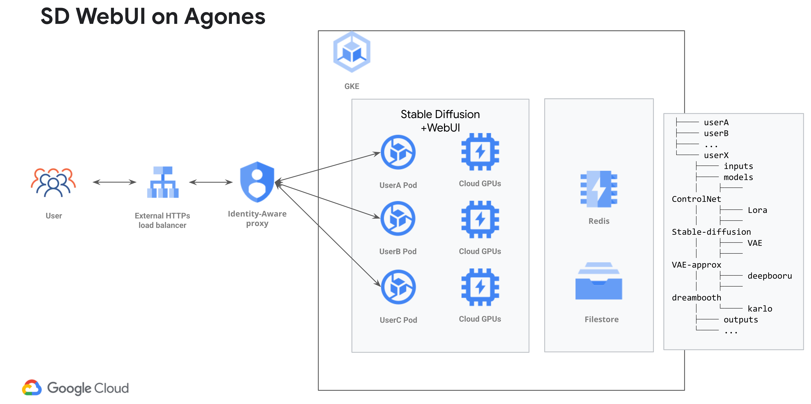
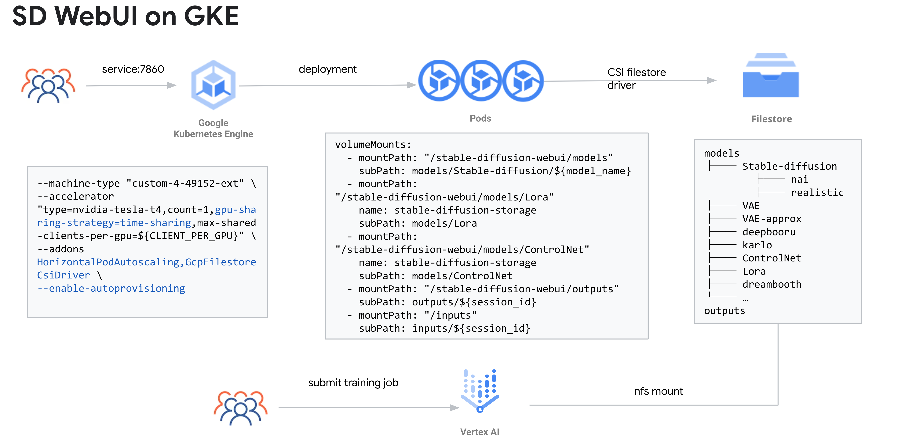
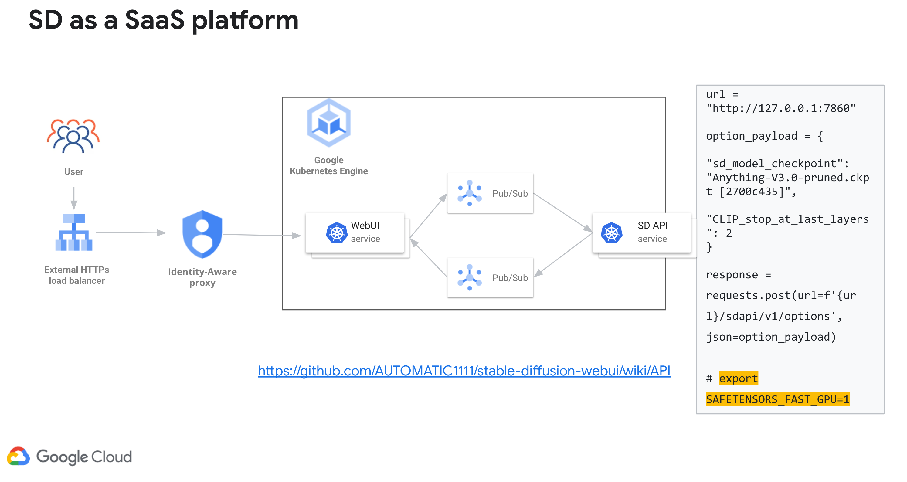

# Stable Diffusion WebUI on Google Cloud Quick Start Guide

This guide provides you steps to deploy a Stable Diffusion WebUI solution in your Google Cloud Project.

## Languages
[简体中文](./README_cn.md)

| Folder                             | Description                                                                                                                                                                                                                                                                                   |
|------------------------------------|-----------------------------------------------------------------------------------------------------------------------------------------------------------------------------------------------------------------------------------------------------------------------------------------------|
| [Stable-Diffusion-UI-Agones](./Stable-Diffusion-UI-Agones/README.md) | Demo with all the YAML files and Dockerfiles for hosting Stable Diffusion WebUI using Agones. |
| [Stable-Diffusion-UI-GKE](./Stable-Diffusion-UI-GKE/README.md) | Demo with all the YAML files and Dockerfiles for hosting Stable Diffusion WebUI using GKE. |
| [Stable-Diffusion-Vertex](./Stable-Diffusion-Vertex/README.md) | Reference codes for DreamBooth & Lora training on Vertex AI |
| [terraform-provision-infra](./terraform-provision-infra/README.md) | Terraform scripts and resources to create the demo environment. |

## Introduction
   This project demos how to effectively host the popular AUTOMATIC1111 web interface [Stable-Diffusion-WebUI](https://github.com/AUTOMATIC11111/stable-diffusion-webui).
   This is for demo purpose, you may need minimum modification according to your needs before put into production. However, it could also be use directly as an internal project.
   

   Projects and products include:
*   [GKE](https://cloud.google.com/kubernetes-engine) for hosting Stable Diffusion and attaching GPU hardware to nodes in your Kubernetes cluster.
*   [Filestore](https://cloud.google.com/filestore) for saving models and output files.
*   [Vertex AI](https://cloud.google.com/vertex-ai) for training and fine-tuning the model.
*   [Cloud Build](https://cloud.google.com/build) for building images and Continuous Integration.
*   [GKE](https://cloud.google.com/kubernetes-engine) Standard clusters running [Agones](https://agones.dev/) for isolating runtime for different users and scaling.
*   [Stable Diffusion](https://huggingface.co/runwayml/stable-diffusion-v1-5) for generating images from text.
*   [Webui](https://github.com/AUTOMATIC1111/stable-diffusion-webui): A browser interface for Stable Diffusion.

## Architecture

* Recommended for most use cases, use dedicated pod+gpu, with (almost) the same experience as running on your own workstation.
* Architecture GKE + Agones + Spot(optional) + GPU(optional time sharing) + Vertex AI for supplementary Dreambooth/Lora training
* Use [Cloud identity-aware proxy](https://cloud.google.com/iap) for login and authentication with Google account
* A demo nginx+lua implementation as a frontend UI to interactive with Agones
* Using Agones for resource allocation and release instead of HPA
* Run Inference, training and all other functions and extensions on WebUI
* Supplementary Dreambooth/Lora Training on Vertex AI
* No intrusive change against AUTOMATIC1111 webui, easy to upgrade or install extensions with Dockerfile


* Recommended for serving as a Saas platform for internal use
* Architecture GKE + GPU(optional time sharing) + Spot(optional) + HPA + Vertex AI for supplementary Dreambooth/Lora training
* No conflicts for multiple users, one deployment per model, use different mount point to distinguish models
* Scaling with HPA with GPU metrics
* Inference on WebUI, but suitable for training
* Supplementary Dreambooth/Lora Training on Vertex AI
* No intrusive change against AUTOMATIC1111 webui, easy to upgrade or install extensions with Dockerfile


* Recommend for serving as an external Saas platform
* You build you own webui and backend(probably), and decouple them with a message queue service(e.g Pub/sub)
* Building your backend pipeline can be more flexible and more cost effective(e.g. TensorRT)
* sd-webui now also support [API mode](https://github.com/AUTOMATIC1111/stable-diffusion-webui/wiki/API).

## FAQ
### Does it support multi-users/sessions?

For [Stable-Diffusion-UI-Agones](./Stable-Diffusion-UI-Agones/README.md), it support multi users/sessions in nature since it assign a dedicated pod for each login user.
For [Stable-Diffusion-UI-GKE](./Stable-Diffusion-UI-GKE/README.md), AUTOMATIC1111's Stable Diffusion WebUI does not support multi users/sessions at this moment, you can refer to https://github.com/AUTOMATIC1111/stable-diffusion-webui/issues/7970. To support multi-users, we create one deployment for each model.

### About file structure on NFS?
For [Stable-Diffusion-UI-Agones](./Stable-Diffusion-UI-Agones/README.md), in the demo we use [init script](./Stable-Diffusion-UI-Agones/sd-webui/user-watch.py) to initialize folders for each users.
You can customize the init script to meet your need, and there is a [reference](./examples/sd-webui/user-watch.py).

For [Stable-Diffusion-UI-GKE](./Stable-Diffusion-UI-GKE/README.md), instead of building images for each model, we use one image with shared storage from Filestore and properly orchestrate for our files and folders.
Please refer to the deployment_*.yaml for reference.

Your folder structure could probably look like this in your Filestore file share, you may have to adjust according to your needs:
```
/models/Stable-diffusion # <--- This is where Stable Diffusion WebUI looking for models
|-- nai
|   |-- nai.ckpt
|   |-- nai.vae.pt
|   `-- nai.yaml
|-- sd15
|   `-- v1-5-pruned-emaonly.safetensors

/inputs/ # <--- for training images, only use it when running training job from UI(sd_dreammbooth_extension)
|-- alvan-nee-cropped
|   |-- alvan-nee-9M0tSjb-cpA-unsplash_cropped.jpeg
|   |-- alvan-nee-Id1DBHv4fbg-unsplash_cropped.jpeg
|   |-- alvan-nee-bQaAJCbNq3g-unsplash_cropped.jpeg
|   |-- alvan-nee-brFsZ7qszSY-unsplash_cropped.jpeg
|   `-- alvan-nee-eoqnr8ikwFE-unsplash_cropped.jpeg

/outputs/ # <--- for generated images
|-- img2img-grids
|   `-- 2023-03-14
|       |-- grid-0000.png
|       `-- grid-0001.png
|-- img2img-images
|   `-- 2023-03-14
|       |-- 00000-425382929.png
|       |-- 00001-631481262.png
|       |-- 00002-1301840995.png
```
### How can I upload file?
We made an example [script](./Stable-Diffusion-UI-Agones/sd-webui/extensions/stable-diffusion-webui-udload/scripts/udload.py) to work as an extension for file upload.
Besides, you can use extensions for image browsing and downloading(https://github.com/zanllp/sd-webui-infinite-image-browsing), model/lora downloading(https://github.com/butaixianran/Stable-Diffusion-Webui-Civitai-Helper) and more.

### How can scale to zero after work?
HPA & Agones only allow at least one replica, to do this you will have to manually scale to 0 or delete the resource.
e.g. For GKE,
```
kubectl scale --replicas=1 deployment stable-diffusion-train-deployment
```
for Agones,
```
kubectl delete fleet sd-agones-fleet
```

### How to persist sd-webui settings?
Two ways to do it
1. Setup golden copy of config.json/ui-config.json and include them in the Docker image.
The items that need to be set are often concentrated in a few of them (e.g. enabling VAE selection in the UI, setting CLIP Skip, setting multi-controlnet, etc.), and do not require frequent modification. \
This method is simple to implement and is therefore the recommended option. \

2. Use another deployment method (jump to this [branch](https://github.com/nonokangwei/Stable-Diffusion-on-GCP/tree/Stable-Diffusion-on-GCP-X))
This branch can independently initialize their respective environments for each pod, including persisting their respective config.json/ui-config.json, but does not support setting the buffer size, resources need to be initialized on demand, and additional deployment steps are required.