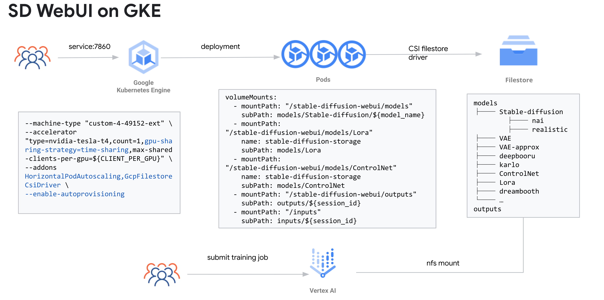

# Stable Diffusion WebUI on Google Cloud 快速入门指南

本指南为您提供了在 Google Cloud 项目中部署 Stable Diffusion WebUI 解决方案的步骤。

## 语言
[English](./README.md)

| 文件夹                             | 说明                                                                                                                                                                                                                                                                                   |
|------------------------------------|-----------------------------------------------------------------------------------------------------------------------------------------------------------------------------------------------------------------------------------------------------------------------------------------------|
| [Stable-Diffusion-UI-Agones](./Stable-Diffusion-UI-Agones/README_cn.md) | 使用 Agones 托管 Stable Diffusion WebUI 的所有 YAML 文件和 Dockerfile 的演示。 |
| [Stable-Diffusion-UI-GKE](./Stable-Diffusion-UI-GKE/README.md) | 使用 GKE 托管 Stable Diffusion WebUI 的所有 YAML 文件和 Dockerfile 的演示。 |
| [Stable-Diffusion-Vertex](./Stable-Diffusion-Vertex/README_cn.md) | DreamBooth & Lora 在 Vertex AI 上训练的参考代码 |
| [terraform-provision-infra](./terraform-provision-infra/README_zh.md) | 用于创建演示环境的 Terraform 脚本和资源。 |


## 介绍
   该项目演示了如何有效地托管流行的 AUTOMATIC1111 Web 界面 [Stable-Diffusion-WebUI](https://github.com/AUTOMATIC11111/stable-diffusion-webui)。
   这是为了演示目的，在投入生产之前，您可能需要根据您的需要进行最少的修改。 但是，它也可以直接用作内部项目。


项目和产品包括：
* [GKE](https://cloud.google.com/kubernetes-engine) 用于托管 Stable Diffusion 并将 GPU 硬件附加到 Kubernetes 集群中的节点。
* [Filestore](https://cloud.google.com/filestore) 用于保存模型和输出文件。
* [Vertex AI](https://cloud.google.com/vertex-ai) 用于训练和微调模型。
* [Cloud Build](https://cloud.google.com/build) 用于构建容器镜像和持续集成。
* [GKE](https://cloud.google.com/kubernetes-engine) 运行 [Agones](https://agones.dev/) 的标准集群，用于隔离不同用户的运行时和实现弹性伸缩。
* [Stable-Diffusion](https://huggingface.co/runwayml/stable-diffusion-v1-5) 用于从文本生成图像。
* [Webui](https://github.com/AUTOMATIC1111/stable-diffusion-webui)：Stable-Diffusion的浏览器界面。

## 架构

* 适用于绝大多数使用场景，每个用户有专用pod+gpu，与在您自己的工作站上运行的体验（几乎）相同。
* 架构: GKE + Agones + Spot(可选) + GPU(可选分时) + Vertex AI 补充 Dreambooth/Lora 训练
* 使用[Cloud identity-aware proxy](https://cloud.google.com/iap) 登录和验证谷歌账户
* 演示中使用 nginx+lua 实现作为前端 UI 与 Agones 交互
* 使用 Agones 代替 HPA 进行资源分配和释放
* 在 WebUI 上运行推理、训练和所有其他功能和插件
* 使用 Vertex AI 来辅助 Dreambooth/Lora 的训练
* 没有针对 AUTOMATIC1111 webui 的侵入式更改，易于升级或使用 Dockerfile 安装插件(extensions)


* 推荐作为 SaaS 平台，由于使用sd-webui，因此适合内部使用
* 架构 GKE + GPU(可选分时) + Spot(可选) + HPA + Vertex AI 补充 Dreambooth/Lora训练
* 多用户不冲突，一个机型一个部署，使用不同挂载点区分机型
* 使用具有 GPU 指标的 HPA 进行扩展
* 适合做WebUI上的推理，但不适合训练，因训练时会独占整个GPU设备
* 使用 Vertex AI 来做 Dreambooth/Lora 的训练
* 没有针对 AUTOMATIC1111 webui 的侵入式更改，易于升级或使用 Dockerfile 安装插件(extensions)


* 可用作对外 Saas 服务的架构
* 您需要构建自己的前端和后端（推荐），前后端之间通过队列服务做解耦
* 构建自己的后端推理流水线可以让后端的功能改造更灵活，以及更多的性能优化空间（如使用TensorRT）
* sd-webui 现在也支持[API 模式](https://github.com/AUTOMATIC1111/stable-diffusion-webui/wiki/API).

## 常问问题
### 它是否支持多用户/会话？

对于 [Stable-Diffusion-UI-Agones](./Stable-Diffusion-UI-Agones/README.md)，它本质上支持多用户/会话，因为它为每个登录用户分配了一个专用的 pod。
对于 [Stable-Diffusion-UI-GKE](./Stable-Diffusion-UI-GKE/README.md)，由于AUTOMATIC1111的Stable Diffusion WebUI暂时不支持多用户/会话，可以参考https://github.com/AUTOMATIC1111/stable-diffusion-webui/issues/7970。为了支持多用户，我们为每个模型创建一个部署(deployment)。

### 关于 NFS 上的文件结构？
对于 [Stable-Diffusion-UI-Agones](./Stable-Diffusion-UI-Agones/README.md)，在演示中我们使用 [init script](./Stable-Diffusion-UI-Agones/sd-webui/user-watch.py) 为每个用户初始化文件夹。
您可以自定义初始化脚本以满足您的需要，并且有一个[参考](./examples/sd-webui/user-watch.py)。

对于[Stable-Diffusion-UI-GKE](./Stable-Diffusion-UI-GKE/README.md)，我们不为每个模型构建一个容器镜像，而是使用一个容器镜像和Filestore的共享存储，并适当地编排我们的文件和文件夹以便每个服务都挂载到特定的文件夹目录。
请参考 deployment_*.yaml 参考。

您的 Filestore 文件共享中的文件夹结构可能如下所示，您可能需要根据需要进行调整：
```
/models/Stable-diffusion # <--- 这是 Stable Diffusion WebUI 寻找模型的地方
|-- nai
| |-- nai.ckpt
| |-- nai.vae.pt
| `-- nai.yaml
|-- sd15
| `-- v1-5-pruned-emaonly.safetensors

/inputs/ # <--- 用于训练图像，仅在从 UI 运行训练作业时使用它 (sd_dreammbooth_extension)
|-- alvan-nee-clipped
| |-- alvan-nee-9M0tSjb-cpA-unsplash_cropped.jpeg
| |-- alvan-nee-Id1DBHv4fbg-unsplash_cropped.jpeg
| |-- alvan-nee-bQaAJCbNq3g-unsplash_cropped.jpeg
| |-- alvan-nee-brFsZ7qszSY-unsplash_cropped.jpeg
| `-- alvan-nee-eoqnr8ikwFE-unsplash_cropped.jpeg

/outputs/ # <--- 用于生成的图像
|-- img2img-grid
| `-- 2023-03-14
| |-- grid-0000.png
| `-- grid-0001.png
|-- img2img-images
| `-- 2023-03-14
| |-- 00000-425382929.png
| |-- 00001-631481262.png
| |-- 00002-1301840995.png
```
### 如何上传文件？
我们做了一个示范[脚本](./Stable-Diffusion-UI-Agones/sd-webui/extensions/stable-diffusion-webui-udload/scripts/udload.py) 以插件的形式实现文件上传。
除此之外，浏览和下载图片(https://github.com/zanllp/sd-webui-infinite-image-browsing)，下载模型(https://github.com/butaixianran/Stable-Diffusion-Webui-Civitai-Helper)等都可以借助插件的方式实现。

### 下班后如何释放资源？
HPA & Agones 只允许至少一个副本，为此你必须手动缩放到 0 或删除资源。
例如 对于 GKE，
```
kubectl scale --replicas=1 stable-diffusion-deployment
```
对于Agones，
```
kubectl delete fleet sd-agones-fleet
```
### 如何保持sd-webui settings里的设置？
有两种方式 \
1. 设置config.json/ui-config.json的golden copy并打包到容器中
需要设置的项往往集中在其中几项目（e.g. UI中开启VAE选择、设置CLIP Skip、设置multi-controlnet等），且不需要频繁修改。
该方式实施简单，因此作为推荐选项

2. 使用另外一种部署方式（跳转到该[分支](https://github.com/nonokangwei/Stable-Diffusion-on-GCP/tree/Stable-Diffusion-on-GCP-X)）
该分支可以做到为各个pod独立初始化各自的环境，包括持久化各自的config.json/ui-config.json，但不支持设置buffer size，资源都需要按需初始化，以及额外的部署步骤。
