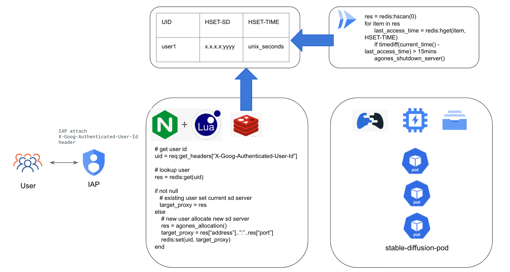

# Stable-Diffusion on Agones 实施指南

本指南为Stable-Diffusion-WebUI用户提供了简单的步骤，以使用 GCP GKE 服务启动Stable-Diffusion-WebUI部署，并使用 Filestore 作为模型和输出文件的共享存储。 为了方便多用户的Stable-Diffusion运行时管理，我们使用了 [Agones](https://agones.dev/site/) 作为运行时管理的控制平面，每个独立的Stable-Diffusion-WebUI都托管在一个独立的 POD 中，每个授权用户 将分配一个专用 POD。 用户只需按照步骤运行Stable-Diffusion-WebUI即可。

* [简介](#简介)
* [操作方法](#操作方法)

## 介绍
本项目使用[Stable-Diffusion-WebUI](https://github.com/AUTOMATIC1111/stable-diffusion-webui)开源作为用户交互前端，客户只需准备Stable-Diffusion模型即可构建/通过容器部署Stable-Diffusion模型。 该项目使用Cloud Build来帮助您使用Stable-Diffusion模型快速构建 docker 镜像，然后您可以基于 docker 镜像进行部署。 为了提供多用户隔离的Stable-Diffusion运行时，使用 [Agones](https://agones.dev/site/) 作为运行时管理的控制平面，Agones 根据用户的资源需求管理和控制Stable-Diffusion运行时的生命周期。

## 架构


## 如何使用
您可以使用Cloud Shell作为运行时来执行以下步骤。

### 在你开始之前
1. 确保您有一个可用的 GCP 项目用于部署
2. 使用 [cloud shell](https://cloud.google.com/shell/docs/run-gcloud-commands) 启用所需的服务 API
```
gcloud services enable compute.googleapis.com artifactregistry.googleapis.com container.googleapis.com file.googleapis.com vpcaccess.googleapis.com redis.googleapis.com cloudscheduler.googleapis.com
```
### 创建 GKE 集群
使用Cloud Shell执行以下步骤。 本指南使用 T4 GPU 节点作为 VM 主机，根据您的选择，您可以将节点类型更改为 [其他 GPU 实例类型](https://cloud.google.com/compute/docs/gpus)。
在本指南中，我们还为models/outputs共享启用了 [Filestore CSI 驱动程序](https://cloud.google.com/kubernetes-engine/docs/how-to/persistent-volumes/filestore-csi-driver)。

```
PROJECT_ID=<将其替换为您的项目 ID>
GKE_CLUSTER_NAME=<将其替换为您的 GKE 集群名称>
REGION=<将其替换为您的区域>
VPC_NETWORK=<将其替换为您的 vpc 网络名称>
VPC_SUBNETWORK=<将其替换为您的 vpc 子网名称>

gcloud beta container --project ${PROJECT_ID} clusters create ${GKE_CLUSTER_NAME} --region ${REGION} \
    --no-enable-basic-auth --release-channel "None" \
    --machine-type "e2-standard-2" \
    --image-type "COS_CONTAINERD" --disk-type "pd-balanced" --disk-size "100" \
    --metadata disable-legacy-endpoints=true --scopes "https://www.googleapis.com/auth/cloud-platform" \
    --num-nodes "1" --logging=SYSTEM,WORKLOAD --monitoring=SYSTEM --enable-ip-alias \
    --network "projects/${PROJECT_ID}/global/networks/${VPC_NETWORK}" \
    --subnetwork "projects/${PROJECT_ID}/regions/${REGION}/subnetworks/${VPC_SUBNETWORK}" \
    --no-enable-intra-node-visibility --default-max-pods-per-node "110" --no-enable-master-authorized-networks \
    --addons HorizontalPodAutoscaling,HttpLoadBalancing,GcePersistentDiskCsiDriver,GcpFilestoreCsiDriver \
    --autoscaling-profile optimize-utilization

gcloud beta container --project ${PROJECT_ID} node-pools create "gpu-pool" --cluster ${GKE_CLUSTER_NAME} --region ${REGION} --machine-type "custom-4-49152-ext" --accelerator "type=nvidia-tesla-t4,count=1" --image-type "COS_CONTAINERD" --disk-type "pd-balanced" --disk-size "100" --metadata disable-legacy-endpoints=true --scopes "https://www.googleapis.com/auth/cloud-platform" --enable-autoscaling --total-min-nodes "0" --total-max-nodes "6" --location-policy "ANY" --enable-autoupgrade --enable-autorepair --max-surge-upgrade 1 --max-unavailable-upgrade 0 --max-pods-per-node "110" --num-nodes "0"
```
**注意：如果您正在创建私有 GKE 集群，请设置防火墙规则以允许**
1. 所有内部 CIDR（10.0.0.0/8、172.16.0.0/16、192.168.0.0/24）。 特别是 pod 的 CIDR 范围，但使用所有内部 CIDR 会更容易。
2. 适用于 TCP 端口 443/8080/8081 & 7000-8000 和 UDP 端口 7000-8000
3. 将源标记作为 gke 节点标记，例如 gke-gke-01-7267dc32-node，您可以在您的 VM 控制台中找到它。

### 获取 GKE 集群的凭证
```
gcloud container clusters get-credentials ${GKE_CLUSTER_NAME} --region ${REGION}
```

### 安装显卡驱动
```
kubectl apply -f https://raw.githubusercontent.com/GoogleCloudPlatform/container-engine-accelerators/master/nvidia-driver-installer/cos/daemonset-preloaded.yaml
```
如果使用L4等最新的显卡，请执行以下指令安装更新的驱动
```
kubectl apply -f https://raw.githubusercontent.com/GoogleCloudPlatform/container-engine-accelerators/master/nvidia-driver-installer/cos/daemonset-preloaded-latest.yaml
```

### 创建Cloud Artifacts作为 Docker 镜像仓库
```

BUILD_REGIST=<将其替换为您首选的 Cloud Artifacts 镜像仓库名称>

gcloud artifacts repositories create ${BUILD_REGIST} --repository-format=docker \
--location=${REGION}

gcloud auth configure-docker ${REGION}-docker.pkg.dev
```


### 构建Stable Diffusion容器镜像
使用提供的 Dockerfile 构建镜像，推送到 Cloud Artifacts 中的 repo

```
cd Stable-Diffusion-on-GCP/Stable-Diffusion-UI-Agones/sd-webui
docker build . -t ${REGION}-docker.pkg.dev/${PROJECT_ID}/${BUILD_REGIST}/sd-webui:0.1
docker push ${REGION}-docker.pkg.dev/${PROJECT_ID}/${BUILD_REGIST}/sd-webui:0.1

```

### 创建文件存储
创建 Filestore 存储，为模型/输出/训练数据准备文件和文件夹
您应该准备一个 VM 来挂载(mount) 文件存储实例。

```
FILESTORE_NAME=<替换为文件存储实例名称>
FILESTORE_ZONE=<替换为文件存储实例区域>
FILESHARE_NAME=<替换为文件共享名称>


gcloud filestore instances create ${FILESTORE_NAME} --zone=${FILESTORE_ZONE} --tier=BASIC_HDD --file-share=name=${FILESHARE_NAME},capacity=1TB --network=name=${VPC_NETWORK}
e.g.
gcloud filestore instances create nfs-store --zone=us-central1-b --tier=BASIC_HDD --file-share=name="vol1",capacity=1TB --network=name=${VPC_NETWORK}

```
部署 PV 和 PVC 资源，将 nfs-server-ip 替换为之前在文件 nfs_pv.yaml 中创建的 nfs 实例的 ip 地址。
```
kubectl apply -f ./Stable-Diffusion-UI-Agones/agones/nfs_pv.yaml
kubectl apply -f ./Stable-Diffusion-UI-Agones/agones/nfs_pvc.yaml
```

### 安装Agones
在 default-pool 上安装 Agones Operator，default-pool 上会长期运行 Agones Operator 。
注意：为了快速启动，您可以使用已经安装了 helm 的 cloud shell。
```
helm repo add agones https://agones.dev/chart/stable
helm repo update
kubectl create namespace agones-system
cd Stable-Diffusion-on-GCP/Stable-Diffusion-UI-Agones
helm install sd-agones-release --namespace agones-system -f ./agones/values.yaml agones/agones
```

### 创建 Redis 缓存
创建一个redis缓存实例来承载访问信息。
```
gcloud redis instances create --project=${PROJECT_ID}  sd-agones-cache --tier=standard --size=1 --region=${REGION} --redis-version=redis_6_x --network=projects/${PROJECT_ID}/global/networks/${VPC_NETWORK} --connect-mode=DIRECT_PEERING
```

记录redis实例连接ip地址。
```
gcloud redis instances describe sd-agones-cache --region ${REGION} --format=json | jq .host
```

### 构建nginx代理镜像
使用提供的 Dockerfile 构建映像， 请将 gcp-stable-diffusion-build-deploy/Stable-Diffusion-UI-Agones/nginx/sd.lua 中的 ${REDIS_HOST} 替换为上一步记录的 ip 地址。

```
cd Stable-Diffusion-on-GCP/Stable-Diffusion-UI-Agones/nginx
REDIS_IP=$(gcloud redis instances describe sd-agones-cache --region ${REGION} --format=json 2>/dev/null | jq .host)
sed "s@\"\${REDIS_HOST}\"@${REDIS_IP}@g" sd.lua > _tmp
mv _tmp sd.lua

docker build . -t ${REGION}-docker.pkg.dev/${PROJECT_ID}/${BUILD_REGIST}/sd-nginx:0.1
docker push ${REGION}-docker.pkg.dev/${PROJECT_ID}/${BUILD_REGIST}/sd-nginx:0.1
```

### 构建agones-sidecar镜像
使用提供的 Dockerfile 构建映像，推送到 Cloud Artifacts 中的 repo。该镜像为可选，目的是为了劫持sd-webui在启动完成之前返回的502，优化最终用户的体验。
```
cd Stable-Diffusion-on-GCP/Stable-Diffusion-UI-Agones/agones-sidecar
docker build . -t ${REGION}-docker.pkg.dev/${PROJECT_ID}/${BUILD_REGIST}/sd-agones-sidecar:0.1
docker push ${REGION}-docker.pkg.dev/${PROJECT_ID}/${BUILD_REGIST}/sd-agones-sidecar:0.1
```

### 利用Agones部署Stable Diffusion WebUI
Deploy stable-diffusion agone deployment，请将deployment.yaml和fleet yaml中的image URL替换为之前构建的容器镜像url。
```
cd Stable-Diffusion-on-GCP/Stable-Diffusion-UI-Agones/agones
sed "s@image:.*simple-game-server:0.14@image: ${REGION}-docker.pkg.dev/${PROJECT_ID}/${BUILD_REGIST}/sd-agones-sidecar:0.1@" fleet_pvc.yaml > _tmp
sed "s@image:.*sd-webui:0.1@image: ${REGION}-docker.pkg.dev/${PROJECT_ID}/${BUILD_REGIST}/sd-webui:0.1@" _tmp > fleet_pvc.yaml
cd -

cd Stable-Diffusion-on-GCP/Stable-Diffusion-UI-Agones/nginx
sed "s@image:.*sd-nginx:0.1@image: ${REGION}-docker.pkg.dev/${PROJECT_ID}/${BUILD_REGIST}/sd-nginx:0.1@" deployment.yaml > _tmp
mv _tmp deployment.yaml
cd -

kubectl apply -f Stable-Diffusion-on-GCP/Stable-Diffusion-UI-Agones/nginx/deployment.yaml
kubectl apply -f Stable-Diffusion-on-GCP/Stable-Diffusion-UI-Agones/agones/fleet_pvc.yaml
kubectl apply -f Stable-Diffusion-on-GCP/Stable-Diffusion-UI-Agones/agones/fleet_autoscale.yaml
```

### 准备 Cloud Function Serverless VPC 访问
创建无服务器 VPC 访问连接器，Cloud Function使用它来连接私有连接端点。
```
gcloud compute networks vpc-access connectors create sd-agones-connector --network ${VPC_NETWORK} --region ${REGION} --range 192.168.240.16/28
```

### 部署 Cloud Function Cruiser 程序
此 Cloud Function 作为 Cruiser 监控空闲用户，默认情况下当用户空闲 15 分钟时，stable-diffusion 运行时将被收集回来。 请将${REDIS_HOST}替换为上一步记录的redis实例ip地址。 要自定义空闲超时默认设置，请通过设置变量 TIME_INTERVAL 来覆盖设置。
```
cd Stable-Diffusion-on-GCP/Stable-Diffusion-UI-Agones/cloud-function
gcloud functions deploy redis_http --runtime python310 --trigger-http --allow-unauthenticated --region=${REGION} --vpc-connector=sd-agones-connector --egress-settings=private-ranges-only --set-env-vars=REDIS_HOST=${REDIS_HOST}
```
记录函数触发器 url。
```
gcloud functions describe redis_http --region us-central1 --format=json | jq .httpsTrigger.url
```
创建Cruiser调度程序。 请在上一步中将 ${FUNCTION_URL} 更改为 url。
```
gcloud scheduler jobs create http sd-agones-cruiser \
    --location=${REGION} \
    --schedule="*/5 * * * *" \
    --uri=${FUNCTION_URL}
```

### 部署 IAP（identity awared proxy身份感知代理）
分配隔离的Stable Diffusion运行时并提供用户访问身份验证功能，使用Google Cloud IAP 服务作为访问网关提供身份检查并将身份传递给Stable Diffusion后端。

配置OAuth 同意屏幕和 OAuth 凭据，请查看 [指南](https://cloud.google.com/iap/docs/enabling-kubernetes-howto#oauth-configure)。

创建静态外部ip地址，记录ip地址。
```
gcloud compute addresses create sd-agones --global
gcloud compute addresses describe sd-agones --global --format=json | jq .address
```

配置BackendConfig，将client_id和client_secret替换为之前创建的OAuth客户端。
```
kubectl create secret generic iap-secret --from-literal=client_id=client_id_key \
    --from-literal=client_secret=client_secret_key
```
将 managed-cert.yaml 中的 DOMAIN_NAME1 更改为环境域，然后部署依赖资源。
```
kubectl apply -f ./ingress-iap/managed-cert.yaml
kubectl apply -f ./ingress-iap/backendconfig.yaml
kubectl apply -f ./ingress-iap/service.yaml
kubectl apply -f ./ingress-iap/ingress.yaml
```

授予授权用户访问服务所需的权限。 [指南](https://cloud.google.com/iap/docs/enabling-kubernetes-howto#iap-access)

### 为服务域名更新DNS记录
将managed-cert.yaml里设置的服务域名的DNS的A记录调整为ingress的external ip，也就是之前创建的ip，$(gcloud compute addresses describe sd-agones --global --format=json | jq .address)
Google签发和托管的证书需要将域名关联到LB/ingress的ip才可以配置成功，具体参考 [文档，第8步](https://cloud.google.com/kubernetes-engine/docs/how-to/managed-certs?hl=zh-cn)

### 访问服务域名
使用IAP授权的用户访问服务域名

### 清空资源
```
kubectl delete -f ./ingress-iap/managed-cert.yaml
kubectl delete -f ./ingress-iap/backendconfig.yaml
kubectl delete -f ./ingress-iap/service.yaml
kubectl delete -f ./ingress-iap/ingress.yaml

gcloud container clusters delete ${GKE_CLUSTER_NAME} --region=${REGION_NAME}

gcloud compute addresses delete sd-agones --global

gcloud scheduler jobs delete sd-agones-cruiser --location=${REGION}
gcloud functions delete redis_http --region=${REGION} 

gcloud compute networks vpc-access connectors delete sd-agones-connector --region ${REGION} --async

gcloud artifacts repositories delete ${BUILD_REGIST} \
    --location=us-central1 --async

gcloud redis instances delete --project=${PROJECT_ID} sd-agones-cache
gcloud filestore instances delete ${FILESTORE_NAME} --zone=${FILESTORE_ZONE}
```


## 常见问题
### 如果我得到 502，我该如何排除故障？
如果在 pod 准备好之前得到 502 是正常的，你可能需要等待几分钟容器准备好（通常是小于 10 分钟），然后刷新页面。
如果它比预期的要长得多，那么
1. 从 pod 检查 stdout/stderr
查看webui是否启动成功
```
kubectl logs -f pod/sd-agones-fleet-xxxxx-xxxxx -c stable-diffusion-webui
```
2. 从nginx+lua deployment检查stderr
```
kubectl logs -f deployment.apps/stable-diffusion-nginx-deployment
```
3. 检查redis键
在重新用于新部署之前清除 redis 中的所有密钥
```
redis-cli -h ${redis_host}
keys *
del *
```
4. 检查cloud scheduler & cloud function，最后一次运行状态应该是“OK”，否则检查日志。

### 为什么Fleet中有一个叫simple-game-server的容器？
这是一个来自 agones 的示例游戏服务器，我们利用它作为游戏服务器 sdk 与 agones 控制平面交互，而无需额外编码和更改 webui。
nginx+lua会调用simple-game-server间接与agones交互进行资源分配和释放。

### 如何将文件上传到 pod？
我们做了一个示范[脚本](./Stable-Diffusion-UI-Agones/sd-webui/extensions/stable-diffusion-webui-udload/scripts/udload.py) 以插件的形式实现文件上传。
除此之外，浏览和下载图片(https://github.com/zanllp/sd-webui-infinite-image-browsing)，下载模型(https://github.com/butaixianran/Stable-Diffusion-Webui-Civitai-Helper)等都可以借助插件的方式实现。

### 如何持久化SD Webui里的setting配置？
由于sd-webui仅在启动时读取config.json/ui-config.json配置文件，启动后的设置项不会主动与文件同步，点击应用设置时会将ui界面的设置同步到文件，因此无法通过软链接的方式持久化这2个文件。
一个折衷办法是配置一个golden配置文件，打包到容器镜像中，避免后续需要频繁修改，[这里](../examples/sd-webui/Dockerfile)有一个参考做法，实现将以下配置持久化，"quicksettings_list": ["sd_model_checkpoint","sd_vae","CLIP_stop_at_last_layers"],