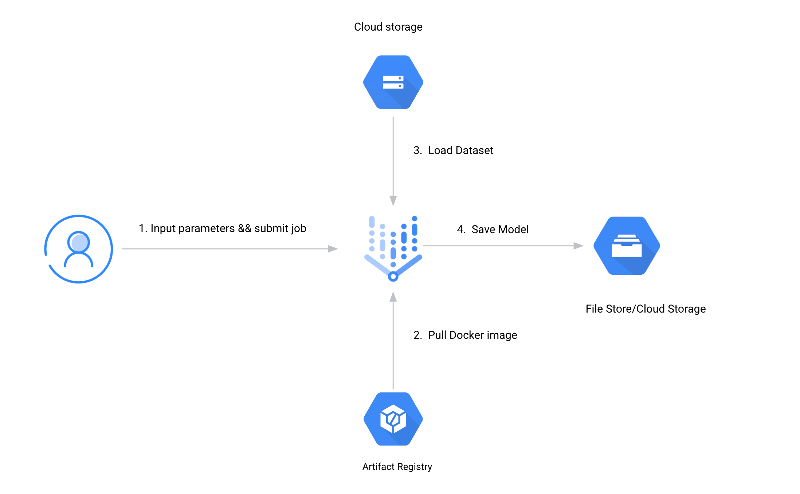
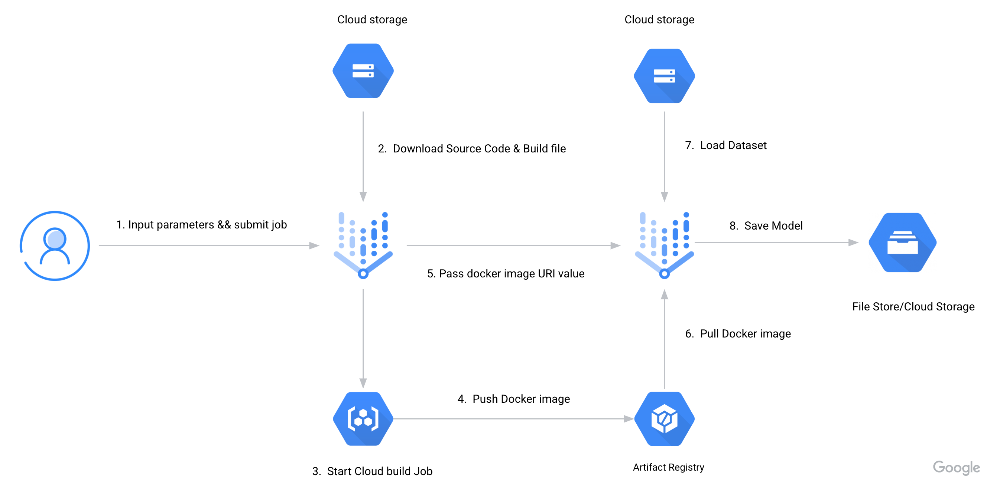
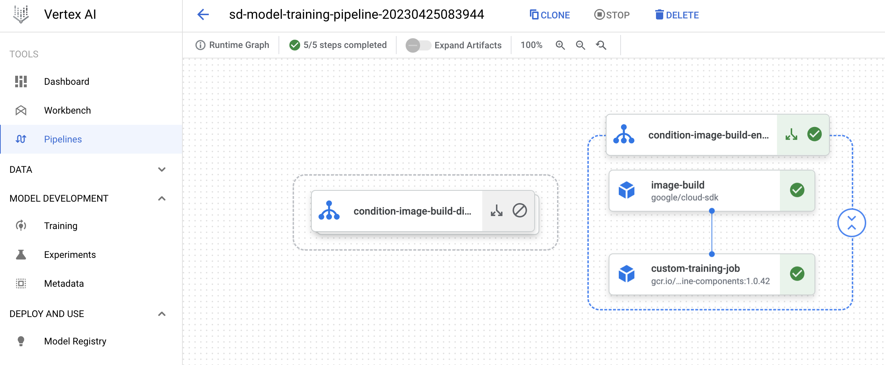

# Stable Diffusion Model Fine-tuning on Vertex AI Pipeline Quick Start

This guide gives a simple example of how to orchestrate an end-to-end ML workflow by using Vertex AI pipeline.

As the pictures shows, in this example we can use a one-stage Vertex AI pipeline to train a stable diffusion Lora model on the Kohya environment, and sync the Lora model files automatically to GCS or Cloud Filestore. In this one-stage method, we need to manually push a Kohya Docker image to the specified Docker registry.


If the Kohya docker image hasn’t been uploaded before, we can also chose to use two-stage Vertex AI pipeline, this first stage in Pipeline will build a Kohya Docker image and automatically push to the google managed Docker registry(Artifact Registry), and then the second stage will start a Vertex AI training job, the training job will also automatically sync  the trained Lora file to GCS or Cloud Filestore.



Whether to choose the one-stage or two-stage pipeline can be configured by setting the docker_build parameter in pipeline_conf.yaml.

## Start Vertex AI pipeline job
It’s very straightforward to start the Vertex AI pipeline, just following the following steps .

1. Clone code repository to local environment, we suggest using Cloud Shell, if you chose using a different terminal, make sure google cloud sdk is well installed and configured.
```
cd gcp-stable-diffusion-build-deploy/Stable-Diffusion-Vertex/pipeline`
```
2. Install Python dependencies
```
pip install requirements.txt
```
3. Configure pipeline configuration settings by editing pipeline_conf.yaml
```
vi pipeline_conf.yaml
```
4. Run pipeline.py to start the vertex AI training job.
```
python3 pipeline.py
```
By running the pipeline.py file, the pipeline script will be compiled automatically and the pipeline job will be started in the background. The pipeline job duration will depend on image number in the dataset and model hyperparameter settings such as batch size and epochs etc.

Pipeline job status can be displayed by visiting the GCP console, more detailed logs can be found by clicking the icon of each step.




